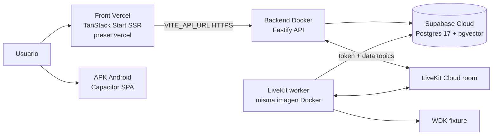

# 03 — Design discussion

Estado: APROBADO — decisiones cerradas por el humano (ver abajo). Referencias: `01-research-questions.md` (D1–D5), `02-research.md`.

## Decisiones cerradas (2026-02)

1. **D1 — Host: Render.** Web Service (API) + Background Worker (worker
   LiveKit), misma imagen Docker con distinto comando de arranque. Siempre-on,
   sin sleep, ~$14/mo. Justificación y comparativa: `02-research.md` §6.
2. **D2 — Postgres: Supabase cloud** (proyecto dedicado, migraciones + seed).
3. **D3 — Voz live: SÍ**, como fase separada después de texto en verde.
4. **D4 — Mobile: APK Android** sideload. iOS/TestFlight fuera de alcance.
5. **D5 — Dominios: subdominios provistos** (vercel.app + onrender.com) para
   esta etapa; dominio propio después.

## Arquitectura objetivo

Una sola imagen Docker con dos procesos (`server.js` API + `livekit/worker.js`),
fail-closed por env: si el worker no tiene LiveKit/OpenAI config, no arranca y la
API de texto queda funcional.

## Fases de implementación (outline base — detalle en `04-structure-outline.md`)

- **F0 — Imagen Docker + compose:** `Dockerfile` multi-stage; `compose.yaml`
  suma el backend como servicio (perfil dev) contra el Postgres local;
  verificación `docker compose up` con flujo de texto fixture completo.
- **F1 — Infra cloud:** proyecto Supabase + migraciones/seed + `DEMO_USER_ID`;
  deploy de la imagen al host elegido (D1) con env de texto; smoke test
  `/v1/health` + login-less chat.
- **F2 — Front en Vercel:** `nitro: { preset: "vercel" }`, proyecto conectado al
  repo, `VITE_API_URL` + `CORS_ORIGINS` cruzados, verificación E2E del flujo
  preview→confirm desde el vercel.app.
- **F3 — Voz live (si D3=yes):** LiveKit Cloud + OpenAI key + par Ed25519 en el
  host; smoke de voz desde el front desplegado.
- **F4 — Mobile:** íconos, permisos, keystore + workflow de APK, build con
  `VITE_API_URL` productivo, instalación de prueba.
- **F5 — Docs:** runbook de deploy (`docs/deploy-runbook.md`) y actualización de
  README.

## Decisiones abiertas (bloquean el outline)

1. **D1 — Host del backend.** Recomendación provisional: Railway o Render
   (deploy de imagen Docker directo, dos servicios desde una misma imagen o
   process manager, tier de entrada accesible). Fly.io si se prefiere control
   fino; VPS solo si ya hay uno.
2. **D2 — Supabase cloud:** asumido sí (no hay alternativa razonable para pgvector
   gestionado al costo de un hackathon). Confirmar quién crea el proyecto.
3. **D3 — ¿Voz live en esta pasada?** Recomendación: sí, pero después de texto
   en verde (F3 separado de F1/F2).
4. **D4 — Mobile target:** recomendación: Android APK sideload. iOS TestFlight
   fuera de alcance de esta etapa.
5. **D5 — Dominio:** empezar con subdominios provistos (vercel.app + del host);
   dominio propio como mejora posterior.

## Riesgos de diseño

- Dos procesos en una imagen: si el host elegido solo permite un comando por
  servicio, se deploya la misma imagen dos veces con distinto comando (api /
  worker). Alternativa: entrypoint con supervisor ligero. Decisión depende de D1.
- `DEMO_USER_ID` en prod (`NODE_ENV=production` obliga a claves y DB): el gate
  de `readApiProcessConfig` exige `LIVE_VOICE_BINDING_PRIVATE_KEY` aunque la voz
  esté apagada — opciones: setear `NODE_ENV` distinto de `production` en test
  env, o generar el par Ed25519 igualmente (lo segundo es más honesto).
- El modelo de embeddings (~90MB) en imagen: preferir prefetch en build para
  que el contenedor sea self-contained.
- Presupuesto: OpenAI Realtime es lo caro; fuera de F3 no hay costo variable.