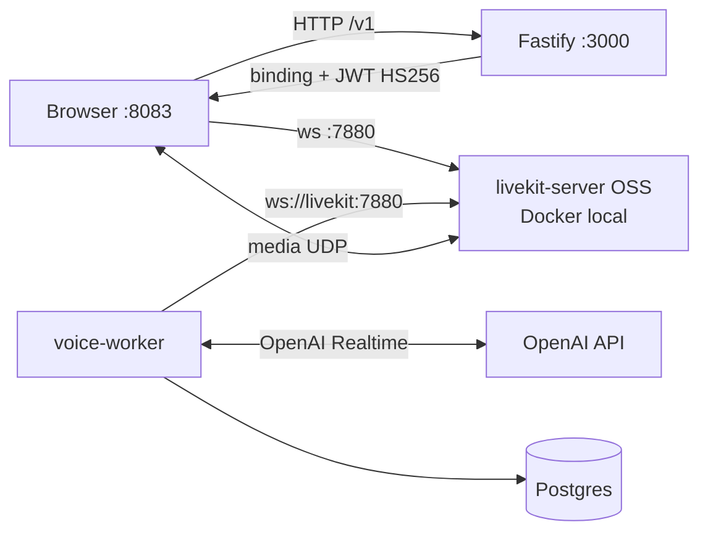

# 03 — Design discussion

Estado: PROPUESTA — pendiente de aprobación humana. Referencias: `02-research.md`.

## Arquitectura objetivo

Sin `cloud-api.livekit.io` en ningún camino. Una sola fuente de verdad de
credenciales: el `.env` git-ignored (`LIVEKIT_API_KEY`/`LIVEKIT_API_SECRET`
existentes, compartidas por server config, worker y mint).

## Work units

### WU-A — Server LiveKit en compose
- `docker/livekit.yaml` (config: puerto 7880, rango UDP 50000-50050, tcp 7881,
  keys desde env via `${...}` del compose o env_file).
- Servicio `livekit` en `compose.yaml` (sin profile: siempre arriba con dev),
  healthcheck HTTP `/`.
- `LIVEKIT_URL=ws://livekit:7880` override en `voice-worker`.
- `LIVEKIT_PUBLIC_URL` (default `ws://localhost:7880`) como env del backend.

### WU-B — Mint de tokens en Fastify
- `POST /v1/livekit/connection-details` (bearer auth igual que el resto de /v1):
  - opcional `conversationId`; si falta, crea conversación (reusa el service);
  - emite binding (misma maquinaria que `/v1/live-bindings`);
  - mintea JWT HS256 con `jose`: claims exactos de `02-research.md` §3,
    room `nani-<conversationId>`, exp ~10 min;
  - responde `{conversationId, bindingToken, serverUrl: LIVEKIT_PUBLIC_URL,
    participantToken}`.
- Sin secretos nuevos; `LIVEKIT_API_KEY/SECRET` ya en `.env` (fail-closed si
  faltan, igual que el worker).

### WU-C — Front: fuente de token propia
- `livekit-web-client.ts`: si `VITE_LIVEKIT_TOKEN_SERVER_ID` → camino sandbox
  actual (compat); si no → `api.createLiveKitConnectionDetails()` y
  `room.connect(serverUrl, participantToken)`.
- `api.ts`: nuevo método (contrato duplicado en `api-types.ts`).
- Sin cambios en publish/binding/revisiones.

### WU-D — Verificación
- Worker registrado en el LiveKit local (`docker compose logs voice-worker`).
- Voz E2E en browser: sin requests a `cloud-api.livekit.io`.
- Phone: `LIVEKIT_PUBLIC_URL=ws://<LAN-IP>:7880` + front en LAN.
- Tests de backend en verde; runbook actualizado (`docs/local-docker-runbook.md`
  + nota en `livekit-development-runbook.md`).

## Riesgos

- **UDP a través de colima** (Docker en macOS): ICE puede degradar. Mitigación:
  rango UDP acotado; fallback binario nativo si hiciera falta (documentado).
- **Room ya existente**: dispatch por token solo al crear la room — los room
  names son únicos por conversación, riesgo bajo.
- **wss/TLS**: fuera de alcance local. El deploy público (WU3-F5 del plan
  deploy-test-env) necesitará Cloud o un livekit con TLS — decisión separada.
- **jti/claims**: usar exactamente el formato capturado; un claim mal formado
  falla en signal (fail-closed, visible rápido).

## Decisiones para el humano

1. ¿Unificamos binding+token en un endpoint (D1, recomendado) o dos llamadas?
2. ¿Livekit en Docker (WU-A) directo, o preferís de entrada el binario nativo?
3. ¿Apruebas la implementación (superficies: compose, docker/livekit.yaml,
   src/api+livekit, front voice client + api.ts, docs)?