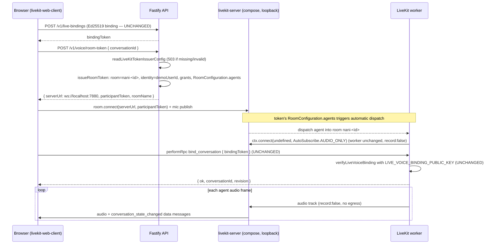

# Design: Local LiveKit Self-Host

## Technical Approach

Self-host `livekit-server` as a loopback-only compose service and close the runbook's "issue LiveKit tokens from Fastify" production gap: the API process signs the browser's room token itself with the same `LIVEKIT_API_KEY`/`LIVEKIT_API_SECRET` the worker already uses. The frontend swaps its token source (Cloud dev token server → local Fastify endpoint) behind an env selector; the connect flow, the Ed25519 binding flow, the worker, and all privacy guarantees stay untouched.

Two token systems remain independent: the binding token (Ed25519, `POST /v1/live-bindings`, verified by the worker) is unchanged; only the LiveKit room token changes signer — from LiveKit Cloud's dev token server to the local API.

## Architecture Decisions

| Decision | Choice and rationale | Alternatives considered |
| --- | --- | --- |
| LiveKit server deployment | Official `livekit/livekit-server` image as a `livekit` service in `compose.yaml`, configured by `docker/livekit.yaml`, all published ports bound to `127.0.0.1`. Consistent with the repo's Docker/Colima setup; no DB, no dependencies, starts standalone. | Locally installed binary kept as a documented fallback for Colima UDP trouble, not the primary route. |
| Token issuer location | Fastify endpoint `POST /v1/voice/room-token` inside `registerVoiceRoutes` (DB-independent, registered unconditionally at `src/server.ts:90`). Issuance logic lives in a dedicated module so the route stays thin and unit-testable without HTTP. | Cloud dev token server cannot point at localhost (`VITE_LIVEKIT_TOKEN_SERVER_ID` is a Cloud resource ID, not a URL). Worker-side issuance would leak signing into the wrong process. |
| Issuer credential validation timing | Lazy per-request validation via an injected issuer provider: missing `LIVEKIT_URL`/`LIVEKIT_API_KEY`/`LIVEKIT_API_SECRET` (or `demoUserId`, or out-of-bounds TTL) produce a `503` with code `voice_token_unavailable` at request time. The API process keeps starting and serving all other routes without LiveKit credentials, exactly like the existing voice routes. | Startup-time throw would make the whole API unusable in deployments that never run voice. |
| TTL out-of-bounds policy | **REJECT, not clamp.** `LIVEKIT_ROOM_TOKEN_TTL` below the 60s minimum throws in the config reader, mapped to `503 voice_token_unavailable` with a message naming the env var and the minimum. Simpler and auditable: a misconfiguration surfaces loudly instead of silently reinterpreted; no too-short token can ever be issued either way. | Clamping hides operator error behind a corrected value nobody asked for. |
| `agentName` source of truth | Request `agentName` (optional) wins if provided; otherwise the server default `LIVEKIT_AGENT_NAME` (fallback `nani-agent`). Server-authoritative default per LLS-005; the frontend keeps passing nothing sensitive. | Rejecting unknown request agent names adds a failure mode with no security value in a demo-user setup. |
| Frontend token source selection | `VITE_LIVEKIT_TOKEN_SOURCE` = `local` (default) \| `cloud`. `local` calls `fetchVoiceRoomToken(conversationId)`; `cloud` keeps `TokenSource.developmentTokenServer` + `VITE_LIVEKIT_TOKEN_SERVER_ID` byte-for-byte. Both satisfy the `{ serverUrl, participantToken }` contract consumed by `room.connect` (`livekit-web-client.ts:121`). | Removing the Cloud path would break the documented rollback (`VITE_LIVEKIT_TOKEN_SOURCE=cloud`). |
| `roomName` authority | Server derives `roomName = nani-${conversationId}` and returns it in the response; the frontend never derives or sends it. Removes the duplicated naming knowledge from the browser. | Keeping frontend derivation preserves the exact drift the proposal calls out. |
| SDK dependency | Declare `livekit-server-sdk` explicitly in root `package.json` at `^2.18.0` — the exact version `@livekit/agents ^1.7.1` already pulls transitively (`@livekit/agents/package.json:50`), so no lockfile drift and no dual-version hoisting. | Pinning an unrelated version risks two `livekit-server-sdk` copies in `node_modules`. |
| HTTP envelope | Raw JSON on success; errors use the existing voice-route error shape `{ status: 'error', message, code }` (`src/api/voice.ts` `/v1/voice/speak` precedent): `400 invalid_body` via zod `safeParse`, `503 voice_token_unavailable`. Matches `rawConversationRequest`'s parsing on the frontend. | The wallet `ApiEnvelope` (`{ ok, data }`) is not what voice/conversation endpoints use. |

## Components and Planned Files

| Path | Action and responsibility |
| --- | --- |
| `docker/livekit.yaml` (new) | Self-hosted server config: port 7880, RTC UDP 7881 + media range, keys from env, no egress/recording/webhooks. |
| `compose.yaml` | New `livekit` service running the official image with the config file and `127.0.0.1`-bound ports. |
| `package.json` (root) | Explicit `livekit-server-sdk: ^2.18.0` dependency (LLS-012). |
| `src/config/livekit.ts` | `readLiveKitTokenIssuerConfig(environment)` — issuer credentials, TTL, default agent name; throws clear errors (LLS-006, LLS-007). Privacy reader unchanged. |
| `src/livekit/token-issuer.ts` (new) | `issueRoomToken(config, { conversationId, agentName? })` — derives room name/identity, builds `AccessToken` with grants + `RoomConfiguration`, returns `{ serverUrl, participantToken, roomName }`. |
| `src/contracts/http.ts` | `voiceRoomTokenRequestSchema` (`conversationId: uuid, agentName?: string`), `voiceRoomTokenResponseSchema` (`serverUrl, participantToken, roomName`). |
| `src/api/voice.ts` | `registerVoiceRoutes(app, options?)` gains an optional `liveKitTokenIssuer` dependency; new `POST /v1/voice/room-token` handler. Existing routes unchanged when the dependency is absent (tests can register voice routes today without options). |
| `src/server.ts` | Builds the issuer dependency (`readLiveKitTokenIssuerConfig` + `demoUserId` from `readRecipientMemoryConfig()`) and passes it into `registerVoiceRoutes` — `bindingPrivateKey` options precedent (`server.ts:75–86`). |
| `src/livekit/worker.ts` | Unchanged; referenced for the dispatch side (worker registers its agent name; `record: false` stays at `worker.ts:130`). |
| `apps/nana-wallet/src/lib/api-types.ts` | `VoiceRoomTokenResponse` type (LLS-010). |
| `apps/nana-wallet/src/lib/api.ts` | `fetchVoiceRoomToken(conversationId)` using `rawConversationRequest` pattern. |
| `apps/nana-wallet/src/features/agent/voice/livekit-web-client.ts` | Token source selector (`VITE_LIVEKIT_TOKEN_SOURCE`), local source, Cloud path preserved. |
| `.env.example` (root), `apps/nana-wallet/.env.example` | Commented English defaults for `VITE_LIVEKIT_TOKEN_SOURCE`, `LIVEKIT_ROOM_TOKEN_TTL`, livekit compose keys. |
| `docs/api.md`, `docs/livekit-development-runbook.md` | Endpoint contract (incl. 400/503 semantics); self-hosted route as local default, Cloud as explicit alternative. |
| `tests/unit/voice-room-token.test.ts` (new) | JWT decode/verify assertions, TTL bounds, 400/503 failure modes. |
| `apps/nana-wallet/src/features/agent/voice/livekit-web-client.test.ts` (colocated, new) | Source selection and response contract. |

## Interfaces

### Config reader — `src/config/livekit.ts`

```ts
export type LiveKitTokenIssuerConfig = {
  url: string;            // LIVEKIT_URL, non-empty (ws://localhost:7880 locally)
  apiKey: string;         // LIVEKIT_API_KEY
  apiSecret: string;      // LIVEKIT_API_SECRET
  defaultAgentName: string; // LIVEKIT_AGENT_NAME ?? 'nani-agent'
  roomTokenTtlSeconds: number; // LIVEKIT_ROOM_TOKEN_TTL, default 600, minimum 60 — REJECT below
};

export function readLiveKitTokenIssuerConfig(
  environment: NodeJS.ProcessEnv = process.env,
): LiveKitTokenIssuerConfig;
```

- Throws `LIVEKIT_URL, LIVEKIT_API_KEY, and LIVEKIT_API_SECRET are required to issue LiveKit room tokens.` when any credential is missing (message names exactly which).
- TTL parsing: integer seconds (positive integer check like `positiveInteger` in `src/config/process.ts`); `LIVEKIT_ROOM_TOKEN_TTL < 60` → throws `LIVEKIT_ROOM_TOKEN_TTL must be at least 60 seconds.` (REJECT decision).
- Privacy reader (`readLiveKitPrivacyConfig`) untouched; the issuer reader does not relax it.

### Issuer — `src/livekit/token-issuer.ts`

```ts
export function issueRoomToken(
  config: LiveKitTokenIssuerConfig & { identity: string },
  input: { conversationId: string; agentName?: string },
): { serverUrl: string; participantToken: string; roomName: string };
```

- `roomName = \`nani-${conversationId}\`` (server-derived, LLS-003).
- `AccessToken(config.apiKey, config.apiSecret, { identity: config.identity, ttl: config.roomTokenTtlSeconds })`.
- Video grants exactly `{ roomJoin: true, room: roomName, canPublish: true, canSubscribe: true }` — no `roomAdmin`, no `roomCreate` (LLS-004; the smoke e2e's admin grants are server-side only and remain there).
- `RoomConfiguration` embedded with `agents: [{ agentName }]` (LLS-005) so the worker is dispatched automatically — this is how the Cloud dev token server triggers the agent today. Field-name verification pinned: `AccessToken` room-config option and the JWT claim (`roomConfig` with `agents`/`RoomAgentDispatch`) MUST be checked against the declared `^2.18.0` typings at implementation time (proposal risk R1); the unit test asserts the decoded JWT rather than trusting the constructor shape.
- `serverUrl = config.url` returned verbatim (LLS-002/LLS-007: browser enters via loopback on the same host).

### HTTP endpoint — `src/api/voice.ts`

`POST /v1/voice/room-token`, inside `registerVoiceRoutes(app, options?: { liveKitTokenIssuer?: LiveKitTokenIssuerDependency })`:

```ts
// src/contracts/http.ts
export const voiceRoomTokenRequestSchema = z.object({
  conversationId: z.string().uuid(),
  agentName: z.string().trim().min(1).optional(),
});
export const voiceRoomTokenResponseSchema = z.object({
  serverUrl: z.string().min(1),
  participantToken: z.string().min(1),
  roomName: z.string().min(1),
});
```

Handler flow: `safeParse(request.body)` → `400 { status:'error', message, code:'invalid_body' }` (existing pattern) → `issuer.issue()`; provider-level misconfiguration (missing credentials, `demoUserId` absent, TTL out of bounds) → `503 { status:'error', message, code:'voice_token_unavailable' }`, no token issued. Response `200` with `{ serverUrl, participantToken, roomName }`.

`server.ts` injection (D1/D-issuer):

```ts
const memoryConfig = readRecipientMemoryConfig(); // already imported there
app.register(registerVoiceRoutes, {
  liveKitTokenIssuer: {
    issue: (input) => issueRoomToken(
      { ...readLiveKitTokenIssuerConfig(), identity: memoryConfig.demoUserId ?? "" },
      input,
    ),
  },
});
```

A missing `demoUserId` surfaces as `503 voice_token_unavailable` (identity is server-owned; without it no correct token can be signed).

### Frontend — `api.ts` / `api-types.ts` / `livekit-web-client.ts`

```ts
// api-types.ts
export type VoiceRoomTokenResponse = {
  serverUrl: string;
  participantToken: string;
  roomName: string;
};

// api.ts — rawConversationRequest pattern (voice/conversation envelope, not ApiEnvelope)
fetchVoiceRoomToken: (conversationId: string) =>
  rawConversationRequest<VoiceRoomTokenResponse>(
    "/v1/voice/room-token",
    jsonRequest("POST", { conversationId }),
  ),
```

`livekit-web-client.ts` (`readConfig` + `connect`):

- New env `VITE_LIVEKIT_TOKEN_SOURCE`: `"local"` (default when unset) | `"cloud"`.
- `local`: requires only `participantIdentity` (`VITE_LIVEKIT_PARTICIPANT_IDENTITY`, sanity check). Fetches `api.fetchVoiceRoomToken(binding.conversationId)` after `createLiveVoiceBinding`, then `room.connect(credentials.serverUrl, credentials.participantToken, ...)` unchanged. Stores `credentials.roomName` (server-owned; the frontend no longer builds `nani-${conversationId}`). Sanity check: decode the JWT payload (`atob`) and verify `identity === participantIdentity`; mismatch → clear error before connect.
- `cloud`: byte-for-byte today's path — `TokenSource.developmentTokenServer(config.tokenServerId).fetch({ roomName, participantIdentity, agentName })`. `VITE_LIVEKIT_TOKEN_SERVER_ID` missing under `cloud` → the existing "Live voice is not configured for this browser." failure before any connect.
- Env semantics after the change: `VITE_LIVEKIT_TOKEN_SERVER_ID` — Cloud-only, ignored under `local`; `VITE_LIVEKIT_AGENT_NAME` — sent to the dev token server under `cloud` only (under `local` the server's `LIVEKIT_AGENT_NAME` decides dispatch, frontend value ignored); `VITE_LIVEKIT_PARTICIPANT_IDENTITY` — sanity check on both paths (identity authority is the server under `local`, the dev token server under `cloud`).

## Data Flow

Voice session start (unchanged steps marked):



## Failure, Security, and Observability

- **`400 invalid_body`**: malformed/missing `conversationId` (LLS-002) — same shape as `/v1/voice/speak`.
- **`503 voice_token_unavailable`**: missing issuer credentials, missing `demoUserId`, or TTL below minimum (LLS-006 REJECT, LLS-007). Clear message naming the offending env var; no token is signed.
- **Security posture**: browser token is short-lived (default 600s), scoped to exactly one room, demo-user identity, no admin grants; admin credentials never leave the server. Frontend supplies only `conversationId` (LLS-011). Worker keeps `record: false` (`src/livekit/worker.ts:130`); `readLiveKitPrivacyConfig` keeps throwing on recording attempts; `docker/livekit.yaml` enables no egress/recording/webhooks — audio stays on loopback (LLS-009). Logs add nothing sensitive (JWTs are never logged).

## Testing Strategy

Backend unit tests (`tests/unit/voice-room-token.test.ts`, no network, no LiveKit server):

1. Issue via `issueRoomToken` with a generated key/secret; verify the JWT with `TokenVerifier` (or decode the payload) and assert: video grants exactly `{ roomJoin, room, canPublish, canSubscribe }`, `room === nani-<conversationId>`, no `roomAdmin`/`roomCreate`, `identity === demoUserId`, embedded `agents` entry for the requested `agentName`, and `exp - iat === ttl`.
2. Default TTL 600s when `LIVEKIT_ROOM_TOKEN_TTL` unset; configured value honored at/above 60; below 60 → reader throws the named message (LLS-006).
3. `readLiveKitTokenIssuerConfig` throws naming each missing credential (LLS-007).
4. Endpoint tests through Fastify `inject`: valid body → 200 with the three fields; bad body → 400 `invalid_body`; issuer misconfiguration → 503 `voice_token_unavailable` (LLS-002/LLS-007).

Frontend colocated tests (`livekit-web-client` + `api.ts`):

1. Source selection: unset `VITE_LIVEKIT_TOKEN_SOURCE` → local path calls `fetchVoiceRoomToken` and does not require `VITE_LIVEKIT_TOKEN_SERVER_ID`; `cloud` + id → `developmentTokenServer` path unchanged; `cloud` without id → clear configuration error, no connect (LLS-008).
2. Response contract: local source feeds `room.connect(serverUrl, participantToken)` with the endpoint's fields and stores the returned `roomName` (LLS-008/LLS-010).

Runbook smoke steps (manual, documented in `docs/livekit-development-runbook.md`): `docker compose up -d livekit` → healthcheck reachability at `ws://localhost:7880` → `npm run livekit:dev` (worker registers against local server) → start API and web app → one non-financial turn and one financial preview→confirm turn → `npm run test:e2e:livekit-smoke` with `LIVEKIT_URL=ws://localhost:7880` (unchanged Ed25519 guarantees).

## Edge Cases

- **Worker not running when a token is issued**: the token remains valid; the room sits empty until the browser connects, and dispatch waits for the worker's registration. `waitForAgent` (`livekit-web-client.ts`) already surfaces "Nani did not join the LiveKit room." after 10s. No backend change.
- **Browser on a different host**: `serverUrl` is `LIVEKIT_URL` verbatim; the documented local assumption is that browser and server share the loopback host. If the browser runs on another machine, the operator must set `LIVEKIT_URL` to a host-reachable address (and the loopback-only privacy claim then applies only to the compose-published ports). Documented in the runbook; no code handles NAT/traversal (no TURN/TLS — out of scope).
- **TTL expiry mid-session**: LiveKit rejects joins/reconnects with an expired token; an established session is not torn down by expiry. A reconnect after expiry needs a fresh token — `connect()` fetches a new one per call, so the documented user recovery is "stop and start live voice again". Documented in the runbook.
- **Colima/Docker UDP media forwarding**: minimal port range in `docker/livekit.yaml`; runbook documents the locally-installed-binary fallback if UDP breaks under Colima.
- **`RoomConfiguration` field shape drift**: implementation must confirm the `^2.18.0` typings (`roomConfig` vs `roomConfiguration`) before wiring; the unit test asserts the decoded JWT, not the constructor call, so a wrong field name fails the build's tests rather than shipping a token without dispatch.

## Out of Scope

- TURN/TLS/certificates (loopback plain HTTP/WS only).
- Any change to the Cloud path: `TokenSource.developmentTokenServer`, its env vars, and its documentation remain as the `cloud` alternative.
- The binding flow: `POST /v1/live-bindings`, Ed25519 keys, worker verification — untouched.
- Runtime selector (`LIVEKIT_AGENT_RUNTIME`), recorded transport, explicit `AgentDispatchClient` outside the gated smoke e2e.

## Requirement Traceability

| Requirement | Answered by |
| --- | --- |
| LLS-001 | compose `livekit` service + `docker/livekit.yaml` sketch (below); loopback-only ports; no egress/recording/webhooks. |
| LLS-002 | `POST /v1/voice/room-token` handler, zod schemas, `{ serverUrl, participantToken, roomName }`, 400 `invalid_body`. |
| LLS-003 | Server-derived `roomName` + `identity: demoUserId`; frontend sanity-check-only `participantIdentity`. |
| LLS-004 | Grants `{ roomJoin, room, canPublish, canSubscribe }`, single room, no admin grants; unit test 1. |
| LLS-005 | `RoomConfiguration.agents` embedding; request `agentName` else `LIVEKIT_AGENT_NAME`/`nani-agent` default. |
| LLS-006 | Default 600s, optional `LIVEKIT_ROOM_TOKEN_TTL`, minimum 60s, REJECT policy. |
| LLS-007 | Lazy provider validation → `503 voice_token_unavailable`; documented in `docs/api.md`. |
| LLS-008 | `VITE_LIVEKIT_TOKEN_SOURCE` selector; local default; Cloud intact; both satisfy the connect contract; frontend tests 1–2. |
| LLS-009 | Worker `record: false` untouched; privacy reader untouched; no-egress server config. |
| LLS-010 | `docs/api.md` + `api-types.ts` updated in the same change; schema/type/actual all `{ serverUrl, participantToken, roomName }`. |
| LLS-011 | Frontend sends only `conversationId`; no grants/room/admin knowledge in the browser. |
| LLS-012 | Explicit `livekit-server-sdk ^2.18.0` in root `package.json` before `src/api/voice.ts` imports it. |

## Config and Service Sketches

### `docker/livekit.yaml` (new)

```yaml
# Self-hosted LiveKit for local development. Privacy-auditable: no egress,
# no recording, no webhooks are configured — audio stays on loopback.
port: 7880
rtc:
  udp_port: 7881
  port_range_start: 60000
  port_range_end: 60100
  # tcp_port, TURN, and egress intentionally absent.
keys:
  # livekit-server performs ${VAR} expansion in its config file; the compose
  # service injects the same .env credentials the API and worker use, so one
  # key/secret pair signs and validates tokens.
  ${LIVEKIT_API_KEY}: ${LIVEKIT_API_SECRET}
# No webhook config, no egress section, no recording section. Their absence is
# the auditable privacy guarantee (LLS-001/LLS-009).
```

### `compose.yaml` — `livekit` service (addition)

```yaml
  livekit:
    image: livekit/livekit-server:latest   # pin the tag at implementation time
    command: --config /etc/livekit.yaml
    environment:
      LIVEKIT_API_KEY: ${LIVEKIT_API_KEY}
      LIVEKIT_API_SECRET: ${LIVEKIT_API_SECRET}
    volumes:
      - ./docker/livekit.yaml:/etc/livekit.yaml:ro
    ports:
      - "127.0.0.1:7880:7880"      # WebSocket/RTC signaling (TCP)
      - "127.0.0.1:7881:7881/udp"  # RTC media (UDP)
      - "127.0.0.1:60000-60100:60000-60100/udp"  # RTC media range
    # healthcheck: verify at implementation time what the image offers
    # (e.g. a wget/curl probe of http://localhost:7880/); document the
    # manual reachability check in the runbook regardless.
```

No database dependency, no volume, no network beyond the default compose network; the service starts with `docker compose up -d livekit` and is reachable at `ws://localhost:7880` (LLS-001).
