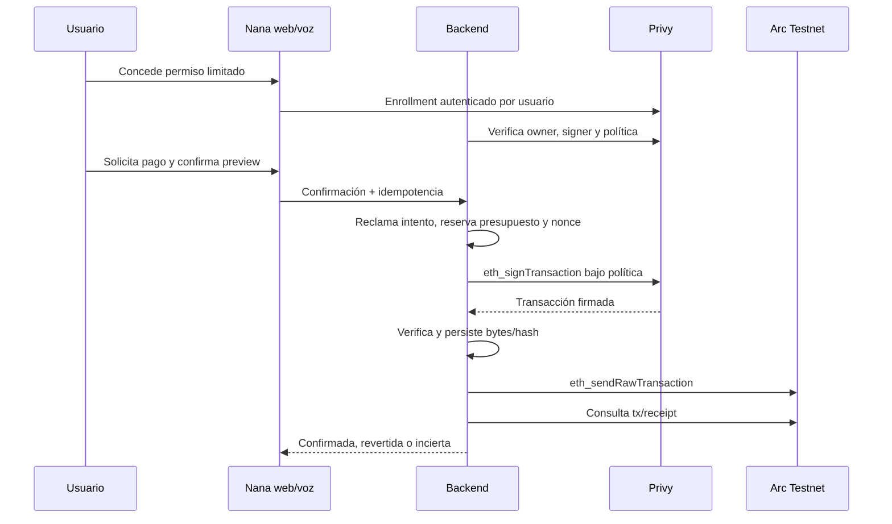

# Design: Privy Embedded Wallets

Revision: 2026-09-08-r3. Product choices approved in the user response: limited backend signer, Privy recovery, Arc Testnet. r3 incorporates the controlling user decision on permission semantics (indefinite user-revocable permission; 10 USDC per transfer; 50 USDC per rolling 3600 seconds; enforcement exclusively through Privy policy configuration; no local SQL spending cap; aggregate concurrency limitation accepted) and fixes F6 (broadcast actor). Fee accounting follows the recorded implementation assumption (transfer caps count amount only; fees displayed and bounded separately) pending user confirmation (Q2). This design is approved for implementation by the user's explicit development authorization.

## Identity and wallet binding

The foundation verifies the access token and resolves users.id. Resolve user_wallets using that UUID; keep the Privy DID only in users. A sync request cannot assert ownership through a bare address, SDK object or client-supplied userId. The backend verifies wallet ownership via Privy's authenticated server API, matching the verified DID and selected user-owned embedded wallet. Pin the actual SDK and ownership fields in WU1. The user is wallet owner; the backend authorization key is only an additional signer.

Store user_wallets(id, user_id, provider, provider_wallet_id, chain_family, address, state, verified_at, timestamps), with unique provider wallet ID and one active selection per user/chain family. FORCE RLS scopes application access. Concurrent first logins coordinate and reconcile existing Privy wallets before creating another. After an external success/local write failure, reuse the externally created wallet. Multiple candidates or mismatched owners block selection. No seed/key material is stored.

## Arc network and units

Values below are pinned from official documentation; live RPC, decimals and gas behavior remain WU1 acceptance checks.

| Parameter | Value |
| --- | --- |
| Network | Arc Testnet |
| Chain ID / CAIP-2 | 5042002 / eip155:5042002 |
| RPC | <https://rpc.testnet.arc.io> |
| Explorer | <https://testnet.arcscan.app/tx/> |
| Transfer asset | USDC ERC-20 interface, 0x3600000000000000000000000000000000000000 |
| Transfer/balance decimals | 6, verified by decimals() |
| Native gas decimals | 18 |

Use ERC-20 balanceOf/transfer for payment amounts. Native balance and gas costs use separate 18-decimal conversions of the same underlying USDC balance; do not sum the balances or apply the existing Circle provider's 18-decimal amount convention to calldata. Quote fee in USDC with exact integer conversions; keep a gas reserve. Unknown chain, contract or decimal metadata rejects. Mainnet and native-value transfers are outside the signing allowlist. Existing Circle code stays unchanged.

## Permission lifecycle and enforcement

User-owned signer_grants records include user/wallet IDs, signer and policy IDs, immutable policy hash/version, allowlisted recipients, per-transfer and rolling-window limit values as configured in Privy (10 USDC per transfer; 50 USDC per rolling 3600-second window), the native gas ceiling configured in Privy, and state. Possible states are pending, active, revoking, revoked and unavailable. There is NO scheduled expiry: the permission is indefinite and remains effective until the user revokes it; `expires_at` is absent from the schema. There is NO local consumed/reserved budget column and NO local spending-cap accounting: enforcement lives exclusively in the Privy policy configuration. Every activated grant requires positive limits and nonempty recipients verified against the effective provider policy before activation. The UI shows the human USDC values before the user authorizes enrollment with Privy. Missing or unverified provider restrictions block activation; fixture values are visibly synthetic and never copied into a live grant.

A grant is separate from login and from payment confirmation. Policy changes or broader limits require a new explicit user grant. The signer cannot edit its policy, add owners/signers, export keys, issue approvals, call arbitrary contracts or sign arbitrary messages. Scope the policy owner to the user/independent authorization rather than giving the spending key unilateral policy-write authority. WU1 must establish the effective Privy app-secret, owner and policy-owner powers, not merely inspect a desired JSON policy. Any route for the spending credential to remove restrictions blocks readiness.

Allow only eth_signTransaction whose chain_id is 5042002, transaction.to is the USDC interface, value is zero, calldata decodes exactly to transfer(recipient,amount), recipient is allowed, amount is positive and within the per-transfer cap. Reject all unlisted RPC methods. The per-transfer and rolling-window limits and the gas ceiling are configured as Privy policies; the application re-reads effective policy settings before activation but never re-implements them. If WU1 cannot prove the provider-side per-transfer amount limit, the rolling 3600-second window or the gas ceiling for this configuration, signing MUST remain disabled. Do not substitute an application-only limit. Decode the exact ABI argument names used by the pinned policy evaluator.

Privy documents stateful aggregation for eth_signTransaction with a native minimum rolling window of 3600 seconds; the 50 USDC total is configured as a per-wallet rolling-window aggregation of ERC-20 transfer amounts. Aggregate updates occur after signing and are not atomic with concurrent signing requests, so concurrent requests can pass before their values are recorded; this aggregate overshoot is an accepted limitation of the selected trust boundary and MUST be surfaced in UI/verification evidence, never silently dropped or compensated by a local cap. Per the recorded fee assumption, the configured caps count transfer amounts only; network fees are displayed separately in USDC and bounded separately by the Privy gas policy — pending explicit user confirmation of fee treatment (Q2). WU1 must establish when the provider aggregation charges a signing request and how duplicate requests are counted; do not assume an unbroadcast signature leaves its counter unchanged.

The app's explicit per-payment confirmation is an application control. Privy restricts the signer to the grant envelope but does not independently prove the user confirmed every payment. A compromised backend may spend inside that envelope; the design does not claim otherwise.

## Signing, broadcast and reconciliation

Keep backend eth_signTransaction followed by RPC eth_sendRawTransaction, instead of a per-payment browser signature. The server constructs exact chain, nonce, gas/fee fields, zero native value and USDC calldata after atomically claiming an owned confirmed preview and reserving the wallet nonce in one transaction. Serialize nonce reservations per wallet, and use provider idempotency for the signing request where documented. Persist operation ID, canonical payload hash, user/wallet/grant version and nonce before calling Privy. Never use the raw client idempotency key across users.

Decode the signed result and verify recovered sender and every transaction field against the claimed intent before storing its raw bytes and hash in restricted backend storage. Signed bytes are a bearer capability and never reach logs, frontend, agent context or generic state inspection. Persist them before broadcast. A crash after signing but before storing bytes never justifies preparing a different transaction: retry/reconcile only that identical signing request under documented provider semantics. If that cannot be proven safe after the provider idempotency window, mark uncertain and stop.

Recheck active grant and current session authorization before dispatch; a concurrent logout/revocation blocks new dispatch if it wins the local lock first. Once signed bytes exist they remain cryptographically usable, and revocation cannot invalidate them. Once RPC dispatch may have happened, preserve uncertainty and reconcile by the known hash. Re-broadcast, if needed, uses only identical stored bytes and hash, never a new nonce or fee bump. Unknown nonce consumption blocks automatic retry. No transaction replacement is in scope.

Distinguish the two lost-response cases (F6): a lost SIGNING response happens between Nana's eth_signTransaction request and Privy's signed-bytes reply — the known state is the recorded operation, payload hash and nonce, and nothing has been broadcast; a lost BROADCAST response happens after Nana's eth_sendRawTransaction reached Arc RPC — the recorded attempt carries the persisted signed bytes and hash to reconcile. Privy never dispatches payments in this design; Nana's backend is the sole broadcaster.

Verify receipt status and actual transaction chain/sender/to/calldata/value before announcing success. Arc has chain-specific event behavior: validate its documented emitter/log format and do not require a conventional ERC-20-emitter event without checking Arc's implementation. A missing receipt, RPC timeout or policy error after ambiguous dispatch is not proof of failure. Distinguish rejected-before-sign, signed, submitted, confirmed, reverted and uncertain. Cancellation cannot undo a signature or transaction already issued. New preview required after recipient version change, fee change beyond the cap, grant modification or revocation.

## HTTP and runtime boundary

Keep /v1/me identity-only. Add authenticated GET /v1/wallets/current, POST /v1/wallets/sync, GET /v1/wallets/current/permission and POST /v1/wallets/current/permission/revoke. Enrollment uses Privy's user-authenticated frontend flow and an authenticated synchronization endpoint that reads back effective signer/policy settings before marking active; the client cannot assert that enrollment succeeded. Exact enrollment DTOs are pinned after WU1. Revoke immediately marks the local grant revoking, blocks new claims and synchronizes provider removal; report provider-unavailable status rather than claiming remote revocation succeeded.

All routes use ApiEnvelope; 401 for bad auth, indistinguishable 404 for foreign/missing resources, 409 for conflicts/stale versions and 503 for unavailable verification. Public permission responses contain readable limits/state, never signing credentials or raw transactions. Define backend Zod contracts and duplicate their types deliberately in the frontend; use common HTTP examples validated independently without cross-project imports.

Replace shared provider selection in src/runtime/dependencies.ts, src/conversations/service.ts and voice dependencies with a trusted per-user wallet/grant resolver. Preserve signed binding checks, preview confirmation, recipient revalidation and atomic conversation claims. The LLM cannot supply authority-bearing owner/provider/grant overrides. Wallet readiness and permission readiness are distinct; permission absence allows owned reads but blocks payments. Privy mode accepts only this verified per-user provider for live execution; the foundation's singleton guard remains for WDK/Circle.

## Recovery and session changes

Use the supported Privy-managed recovery flow for the selected user-owned wallet architecture; no Nana-managed recovery password/seed. Recover on a clean browser and prove same address plus usable owner access. Recovered login alone does not reactivate an expired/revoked grant. Before allowing backend payments re-read signer/policy and local grant state. Losing all configured authentication/recovery factors has no guaranteed recovery promise.

Logout/session change increments the foundation generation, clears cached wallet/permission data and disconnects voice. A late sync result or grant callback from A cannot affect B. Already signed/submitted attempts reconcile under A. Same-user later login retrieves durable status instead of repeating the payment.

## Verification and unresolved technical evidence

WU1 must pin SDK version/API shape and prove owner control, signer restrictions including cumulative cap and gas, policy non-escalation, revocation, supported recovery and signing for chain 5042002. Read-only documentation supports planning but is not a live SDK result. No PRIVY_* names were present in vault-env list; required proposed keys are PRIVY_APP_ID, PRIVY_APP_SECRET, PRIVY_VERIFICATION_KEY and PRIVY_AUTHORIZATION_PRIVATE_KEY, with public VITE_PRIVY_APP_ID configuration. Do not provision or expose key values during planning. Phone delivery channel is preserve-existing, exact channel unverified.

Run backend lint/typecheck/tests with DB/eval/build; frontend lint/typecheck/tests/build; Portless browser E2E against fixture API with A/B, enrollment, preview-confirm-cancel, revoke, logout and recovery doubles. Run provider-negative tests that attempt forbidden methods, policy edits, overspend, wrong chain/address/decimals and concurrent requests. Live smoke requires configured Privy, OTP access, authorized finite grant and separately authorized Arc test funds/transfer. Record blockers and testnet receipts; do not mark live gates passed from fixtures.

Sources checked 2026-09-08: [Arc configuration](https://docs.arc.io/arc/references/connect-to-arc), [Arc USDC interfaces](https://docs.arc.io/arc/references/contract-addresses), [Privy policy engine](https://docs.privy.io/controls/policies/overview), [stateful policies](https://docs.privy.io/controls/policies/stateful-policies), [transaction signing](https://docs.privy.io/api-reference/wallets/ethereum/eth-sign-transaction), [signer enrollment](https://docs.privy.io/wallets/using-wallets/signers/quickstart), [recovery](https://docs.privy.io/wallets/advanced-topics/new-devices/provision-new-devices).
