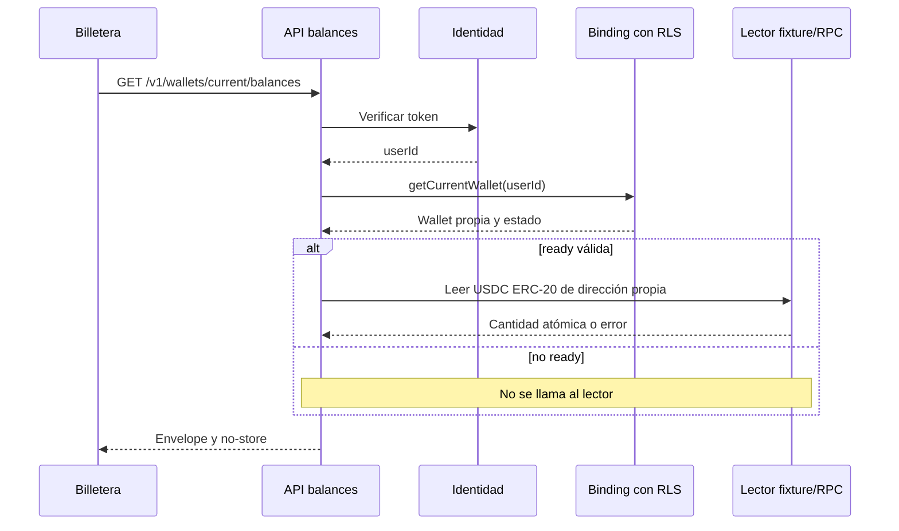
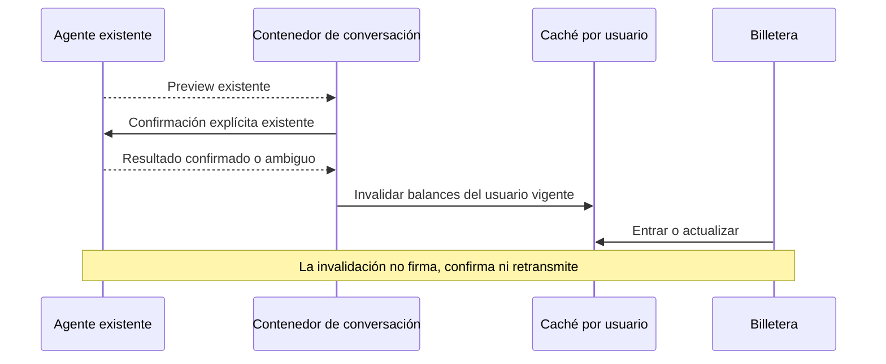

# Diseño técnico: Billetera y Mi perfil

## Context
Propuesta y spec de este cambio derivan del outline r2 aprobado, SHA-256 9945e035bad67e4e42abb7f9629411d140a472e0ec401ba6f72610d63655fd32. Base de referencia: manifiesto .agent-workflow/tasks/wallet-profile/privy-snapshot.json; no equivale a un commit final de Privy. Aplicación pendiente.

La identidad llega por /v1/me; getCurrentWallet(userId) resuelve el binding bajo RLS. El endpoint legado wallet/balance usa core.walletReads global y queda fuera de esta ruta. WalletLifecycle consulta permisos y contactos, por eso no debe montarse para leer saldo.

## Goals / Non-Goals
Entregar WP-001..WP-016 con lecturas personales y estados observables. Sin cambio de operaciones de pago, monedas/redes adicionales ni captura de datos de perfil. La preservación de módulos secundarios no implica mantener sus accesos dentro de las pantallas simples.

## Decisions

### D1: servicio de balances separado de firma (WP-003..WP-009)
Crear src/wallet/balances.ts con WalletBalancesService y BalanceReader inyectable. La ruta autentica, rechaza query/body no vacíos, resuelve wallet propia y entrega únicamente la dirección validada al lector. En estados no ready, responde sin invocar lector. En ready, exige chainFamily arc, address EVM válida y binding coherente; falla 409 WALLET_DATOS_INVALIDOS si no lo están.

El servicio no recibe métodos de sync, permisos, firma o broadcast. La interfaz mínima del lector es readUsdcAtomic(address, signal) y devuelve string atómico; reloj inyectable fija observedAt solo al completar. El flujo normal de identidad puede actualizar last_seen_at, pero la lectura no crea ni modifica bindings, grants u operaciones. No reutilizar core.walletReads como fallback.

### D2: contrato cerrado y errores (WP-004..WP-007, WP-013)
Definir zod en src/contracts/http.ts y reflejar el tipo manualmente en apps/nana-wallet/src/lib/api-types.ts. La respuesta de éxito usa la unión por walletState de WP-004/005; código de error estable en envelope. La variante no ready omite address/source. source fixture|rpc en ready describe el origen real del monto.

| Situación | HTTP | Resultado |
| --- | --- | --- |
| Identidad inválida | 401 | Error de autenticación existente, sin leer wallet |
| Query/body con selección de recursos | 400 | INVALID_QUERY |
| Wallet ready válida | 200 | Ready con un activo y observedAt |
| Wallet no ready | 200 | Estado exacto, assets [], observedAt null |
| Binding ready inconsistente | 409 | WALLET_DATOS_INVALIDOS |
| RPC/timeout/red/ABI inválidos | 503 | BALANCE_NO_DISPONIBLE |

Aplicar Cache-Control: private, no-store a éxito y error. Sanitizar mensajes, sin URL RPC ni payload crudo. GET no acepta body; si el framework lo rechaza antes, mantener semántica 400 sin ejecutar el lector. No almacenar datos personales extra.

### D3: catálogo y adaptador RPC (WP-006..WP-009)
Catálogo privado fijo: chainId 5042002; USDC 0x3600000000000000000000000000000000000000; decimals 6. BALANCE_READ_SOURCE=fixture por defecto; rpc exige BALANCE_RPC_URL. Configurar con lectura opaca de entorno, sin imprimir valores. No cambiar WDK_TOOLS_SOURCE ni habilitar firma.

El adaptador emite eth_chainId, eth_call decimals() (selector 0x313ce567) y eth_call balanceOf(address) (0x70a08231 + dirección rellenada a 32 bytes). Bloque latest. Comprueba version 2.0, ID correlacionado, ausencia de error, hex y valores ABI de 32 bytes. Un AbortController/deadline cubre la secuencia completa durante 8 s; sin retries internos. Rechazar cadenas incorrectas y decimals != 6 antes de aceptar saldo. Parsear con BigInt y serializar decimal canónico sin Number.

Arc expone un mismo balance mediante la representación nativa de 18 decimales y la interfaz ERC-20 de seis. Se usa solo la segunda; no sumar ni convertir una respuesta eth_getBalance como si fueran seis decimales. Confirmado en [contratos oficiales](https://docs.arc.io/arc/references/contract-addresses) y [modelo de stablecoin](https://docs.arc.io/arc/concepts/stablecoin-native-model), consultados el 2026-09-09. La verificación de cadena de esta feature es operativa contra RPC, además de la constante heredada.

El lector fixture usa un mapa por dirección, no un monto universal. Ausencia de entrada produce error explícito. El mapa se configura solo al construir las dependencias; no crear endpoints de fixture que admitan dirección ajena. Probar el adaptador rpc real contra un servidor JSON-RPC local controlado; no hace falta consultar una wallet real ni manejar fondos para esa prueba.

### D4: composición frontend (WP-001, WP-002, WP-010..WP-012, WP-015)
/Perfil solo monta la query /me y LogoutButton con resetSession/queryClient.clear existentes. Quitar «Usuario ...» y cualquier DID. Nombre ausente se deriva de trim sin persistir cambios. Los bloques de contactos/agenda/facturas se extraen a features/profile/LegacyProfileSections.tsx; cuentas/movimientos se preservan en features/wallet/LegacyMoneySections.tsx. Esos componentes no se montan desde las pantallas simples; conservar dentro de ellos su lógica de confirmación y registrar su ubicación.

/mi-plata espera identidad válida y consulta balances. Render de error de identidad precede al de carga dependiente. Para ready presenta USDC con formato exacto; para no ready explica el estado sin monto. Al pulsar Administrar billetera se monta WalletLifecycle en sección independiente; sus fallos no alteran balance. No desplegar slices intermedios que retiren el acceso al lifecycle antes de restituirlo.

Mostrar source fixture como demostración. Usar string/BigInt para parte entera y fracción de seis cifras; separadores es-AR, trim de ceros finales permitido sin alterar valor. No anunciar una cotización ni convertir a pesos. Montos y nombres largos no desbordan en 390 px. Carga con role status; errores con role alert; botones con foco visible. El instante mostrado es observedAt, no el render.

### D5: caché e invalidación (WP-011, WP-013, WP-014)
queryKeys.balances(userId, chainId) = ["balances", userId, chainId]. No consulta si falta userId. staleTime=30000, refetchOnMount="always", retry=false, refetchInterval=false. Refetch explícito por botón. Error de refresco oculta monto previo incluso si React Query mantiene data; error tiene prioridad sobre data en render.

Preservar guardia beginRequest/resetSession/generation de apps/nana-wallet/src/lib/session-isolation.ts; no introducir un segundo contador. Logout/cambio de identidad aborta peticiones y borra caches antes de renderizar la siguiente cuenta. Callback tardío verifica generación vigente. Limpiar también estado local visible de la pantalla; una queryKey por usuario por sí sola no cubre /me ni estado local.

Puntos de invalidación a implementar:
1. apps/nana-wallet/src/routes/index.tsx: agregar nueva clave propia a refreshMoneyQueries(), que ya cubre nextTurn.status sent y lockUnknownOutcome(). No ampliar prefijos a todos los usuarios.
2. En el mismo contenedor de ruta, observar transición del estado autoritativo de conversación a transacción confirmada tras decide() o refreshRevision() proveniente de voz. Elegir un identificador estable de transacción/revisión existente para invalidar una vez, sin engancharse solo a un transcript. Verificar la forma exacta de ese estado al reconciliar Privy, antes de apply. Los hooks useConversationState/useLiveVoiceSession mantienen sus responsabilidades de transporte; no emitir dispatch extra desde invalidación.
3. Si una vía activa usa ConfirmarPlata, incluir invalidación propia en callbacks onCloseReceipt/onUnknownOutcome del contenedor que la monta. Los componentes secundarios preservados pueden invocar el mismo helper cuando se reutilicen, sin montarlos ahora para invalidar.

La elección del campo de deduplicación queda acotada por el contrato de conversación final de Privy; no es una nueva decisión de producto. Verificar texto, decisión por botón, voz autoritativa y resultado incierto. No invalidar por cancelación ni otorgamiento de permisos solamente.

## Flujos

## Verification and Migration
Sin migración de datos. Instalar deps y levantar Postgres/pgvector aislado, migrar la base Privy, usar tokens ES256 de pruebas sin bypass en producción. VITE_E2E_REAL_BACKEND=1 deshabilita MSW. El harness nuevo falla si Chromium no ejecuta casos. Nombres Portless propios para API/web; Compose con proyecto y volumen propios. Aplicar todos los checks y matriz WP-016, incluyendo RLS, errores, decimales y sesión A→B con respuesta tardía.

## Risks and Open Questions
No hay pregunta de producto abierta. Dependencia técnica pendiente: commit final y contrato reconciliado de Privy. Los artefactos actuales no conceden evidencia live a Privy ni resuelven sus permisos/gas. La lectura de saldo es independiente de esos permisos; no debe detenerse por grant revoked ni habilitar firma para avanzar.

Preservar módulos fuera del render reduce alcance visible a lo aprobado, pero no deja contactos como nueva funcionalidad accesible. Si se pide exponerlos otra vez, será cambio de alcance. El acceso a WalletLifecycle usa lo existente; esta tarea no agrega administración de destinatarios.

Rollback: cambio revisable de slices propios o lector fixture, sin revertir Privy ni afectar pagos ya enviados. No merge/publicación automática.
